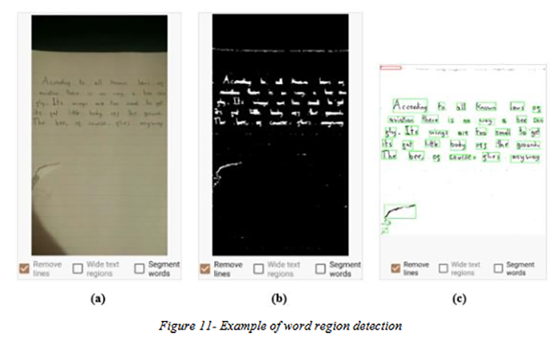
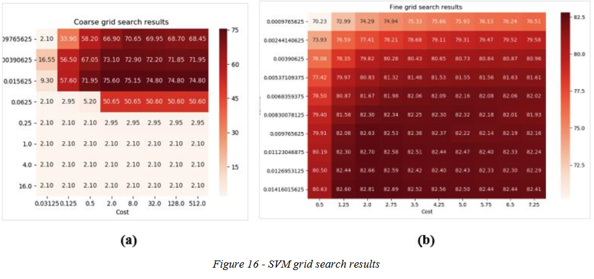

A note-taking Android application which utilises Computer Vision and Machine Learning methodologies to perform OCR on images of handwriting.

Within this application lies the ability to select an image for a note, after which it is fed into the application’s OCR pipeline. Using Computer vision/Image processing techniques,the image is pre-processed, text regions are found and ordered, finally those are regions segmented into individual symbols. Those symbols are then classified using a Support Vector Machine that is trained and optimised for character recognition. This all results in a string of characters containing the best approximation of the image text, which is then finally saved to a new note.

The support vector machine was trained and tested extensively; training hyperparameters and performance evaluations have been. The application was made as a final year project at university. While the classification and overall pipeline accuracy is far from perfect, the foundations have clearly been laid. With further improvments and changes, the application will be published on the Google Play Store for anyone to use. Screenshots from the dissertation writeup can be found below.

